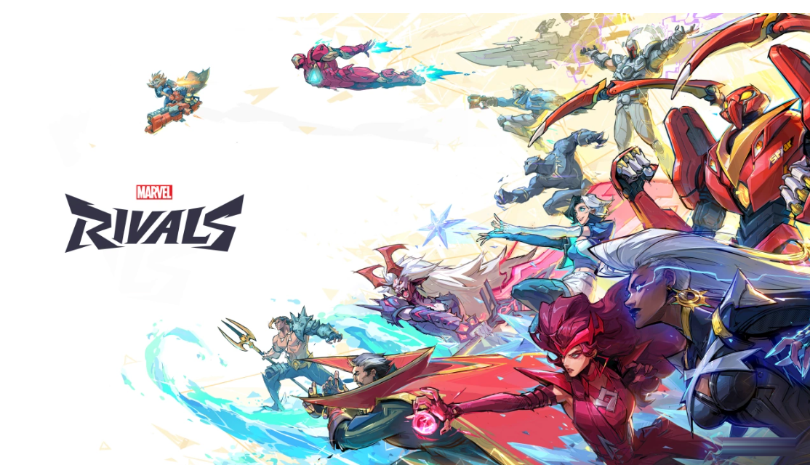

# Marvel Rivals Ranking

The Marvel Rivals Ranking service allows you to track the current ranking (also known as meta) of the duelists, 
strategists, and vanguards in the 
hero, shooter video game Marvel Rivals by [NetEase Games](https://www.neteasegames.com/).

To effectively utilize this service, users should update the hero roster of Marvel Rivals as the game progresses. As of May 22, 2025, Marvel Rivals releases a new season every two months (noting the halfway point with .5) and a new hero every month.  

**NOTE**:

## Documentation

- [Introduction](../README.md)
- [Getting Started](tutorials/Getting_started.md)
- [Add a New Hero](<tutorials/add-a-new-hero OLD.md>)
- [Duelist Resource](../api/duelist-resource.md)
- [GET Duelists](../api/get-duelists.md)
- [POST Duelists](../api/Post-duelist.md)
- [Strategist Resource](../api/strategist-resource.md)
- [GET Strategists](../api/Get-strategist.md)
- [POST Strategists](../api/Post-strategist.md)
- [Vanguard Resoruce](../api/vanguard-resource.md)
- [GET Vanguards](../api/Get-vanguard.md)
- [POST Vanguard](../api/Post-vanguard.md)

## Contributing documentation

Feel free to contribute new documentation and improve existing the existing docs.

If you'd like to contribute:

1. Fork this repository to your own GitHub account.
2. Make sure you can build a local copy of the documentation from your fork.
3. Install [Vale](https://vale.sh/) on your development or editing computer.
   To help you have a successful pull request experience, it's also helpful
   to add these extensions if you edit in VSCode:
    * Markdown lint
    * Vale VSCode
4. A successful pull request:
    * Must not require additional content in order for your pull request to work.
    * Must help the end user of the product. Ideally you'll address an issue, while some opportunities for improvement don't have a corresponding issue.
    * Must have no lint or Vale errors.
    * Must have no errors in any code examples.
5. Test your changes locally from your feature branch before you submit a pull request.

This code is experimental and is intended for instructional use only.
Use at your own risk. No warranty of serviceability is expressed or implied.