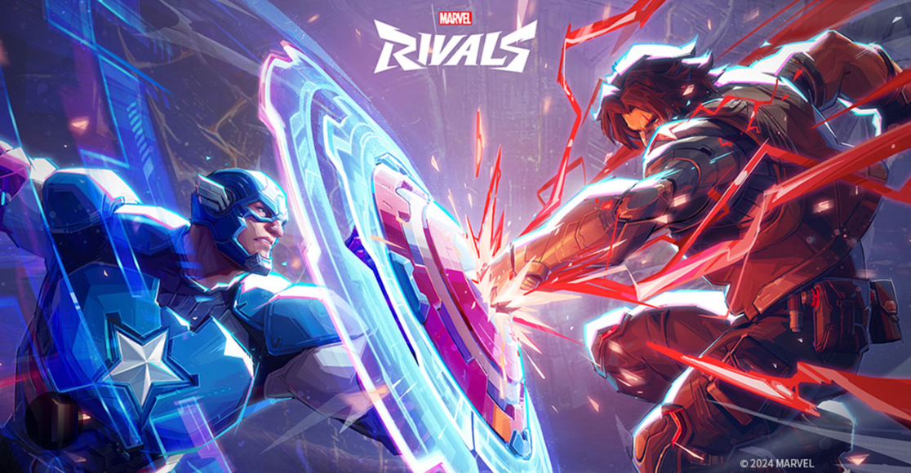

# Marvel Rivals Ranking


The Marvel Rivals Ranking service allows you to track the current ranking (also known as meta) of the duelists, 
strategists, and vanguards in the 
hero, shooter video game Marvel Rivals by [NetEase Games](https://www.neteasegames.com/).

To effectively utilize this service, users should update the hero roster of Marvel Rivals as the game progresses. As of May 22, 2025, Marvel Rivals releases a new season every two months (noting the halfway point with .5) and a new hero every month.  

## Getting Started



<mark>Adapted from To-do service API overiew. </mark>
<br>This tutorial shows you how to download the API files and try one of the available services. If you already [set up your development environment](/docs/tutorials/dev-env.md), the process should take about 15 minutes.

### Step 1: Confirm if you have the API files
The files are located in the [Marvel-Rivals repo](https://github.com/Davejurgens/marvel-rivals-repo) on 
GitHub. The 
directory contains the following files:

- `db.json`: a JSON file containing Marvel Rival profiles.
- `start-server.sh`: a shell script that starts JSON Server. Use this for Linux or macOS.
- `start-server.bat`: a batch file that starts JSON Server. Use this for Windows.

### Step 2: Start JSON Server with the `comic-book-database` service
1. Open a terminal window and `cd` to the location of the json-server app.
2. Make sure the API files are in the same directory.
3. Start the service by typing `json-server -w comic-book-database.json`. You should see some text to show the service is running:

    ```
     macBook:api <username>$ json-server -w comic-book-database.json

     \{^_^}/ hi!

     Loading comic-book-database.json
     Done

     Resources
     http://localhost:3000/comicBooks
     http://localhost:3000/comicTradePaperBacks

     Home
     http://localhost:3000

     Type s + enter at any time to create a snapshot of the database
     Watching...
    ```

### Step 3: List the comic books
You can use cURL or Postman to list all the comic books.

#### If you’re using cURL
1. Open a terminal window.
2. Run this command:
```
curl http://localhost:3000/comicBooks
```
#### If you’re using Postman
1 In Postman’s main panel select GET and add the following content to the URL text box: http://localhost:3000/comicBooks/.

### Step 4: Check the response
The response pane should show all the comic books. An example below. 
 ```
   {
     "batman": [
    {
      "issueNumber": 1,
      "publisher": "DC_Comics",
      "date": "Spring_1940",
      "conditionGrade": "7.5",
      "status": "Restored",
      "upcCode": "0087021001",
      "tradePrice": 198000,
      "currency": "USD"
    }
```
## Add a New Hero
## Duelist Resource
## GET Duelists
## POST Duelists
## Strategist Resource
## GET Strategists
## POST Strategists
## Vanguard Resoruce
## GET Vanguards
## POST Vanguard

- [Introduction](../README.md)
- [Getting Started](tutorials/Getting_started.md)
- [Add a New Hero](<tutorials/add-a-new-hero OLD.md>)
- [Duelist Resource](../api/duelist-resource.md)
- [GET Duelists](../api/get-duelists.md)
- [POST Duelists](../api/Post-duelist.md)
- [Strategist Resource](../api/strategist-resource.md)
- [GET Strategists](../api/Get-strategist.md)
- [POST Strategists](../api/Post-strategist.md)
- [Vanguard Resoruce](../api/vanguard-resource.md)
- [GET Vanguards](../api/Get-vanguard.md)
- [POST Vanguard](../api/Post-vanguard.md)

## Contributing documentation

Feel free to contribute new documentation and improve existing the existing docs.

If you'd like to contribute:

1. Fork this repository to your own GitHub account.
2. Make sure you can build a local copy of the documentation from your fork.
3. Install [Vale](https://vale.sh/) on your development or editing computer.
   To help you have a successful pull request experience, it's also helpful
   to add these extensions if you edit in VSCode:
    * Markdown lint
    * Vale VSCode
4. A successful pull request:
    * Must not require additional content in order for your pull request to work.
    * Must help the end user of the product. Ideally you'll address an issue, while some opportunities for improvement don't have a corresponding issue.
    * Must have no lint or Vale errors.
    * Must have no errors in any code examples.
5. Test your changes locally from your feature branch before you submit a pull request.

This code is experimental and is intended for instructional use only.
Use at your own risk. No warranty of serviceability is expressed or implied.