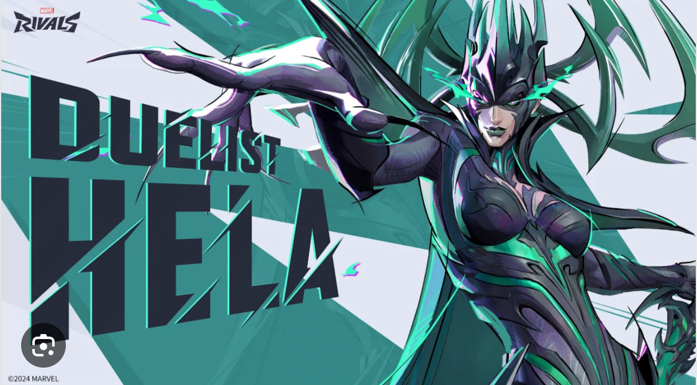

# `duelist` resource



Base endpoint:

```shell

{server_url}/duelist
```

Contains information about the builds of Duelist superhero characters in the Marvel Rivals video game. A Duelist is a damage dealing hero focused on eliminating enemies and securing kills quickly. A Duelist resource provides details about the name of a duelist superhero, damage type, difficulty level, and ID.

## Resource properties

Sample `duelist` resource

```js

],
  "duelists": [
    {
      "superhero_name": "Scarlet Witch",
      "damage_type": "Projectile, Area of Effect",
      "difficulty": "3",
      "id": 1
    },
```

| Property name    | Type    | Description                                                                |
|------------------|---------|----------------------------------------------------------------------------|
| `superhero_name` | string  | The name of the superhero character (e.g., "Scarlet Witch")                |
| `damage_type`    | string  | The type of damage the superhero does (e.g., "Projectile, Area of Effect") |                              |
| `difficulty`     | integer | The ranking level of difficulty (e.g., "3")                                |
| `id`             | integer | The id (e.g., "1")                                                         |


This resource can be used to rank the spec of the best character to play in Marvel Rivals, including adding, updating, and 
retrieving detailed 
information about each superhero in the game.


