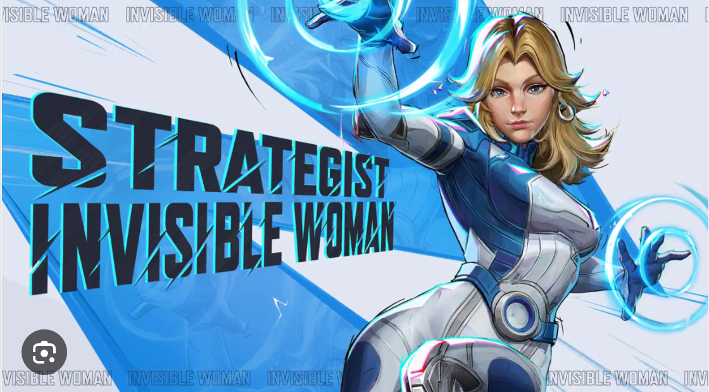

# `strategist` resource



Base endpoint:

```shell

{server_url}/strategist
```

Contains information about the build of the Strategist superhero characters in the Marvel Rivals video game. A 
Strategist is a damage dealing hero focused on healing, buffing, and controlling the battlefield to aid the team. A 
Strategist resource provides 
details about the name of a 
Strategist superhero, healing type, damage type, difficulty level, and ID.

## Resource properties

Sample `strategist` resource

```js

],
  "strategists": [
    {
      "superhero_name": "Cloak and Dagger",
      "healing_type": "Hit Scan (with Auto Aim), Area of Effect",
      "damage_type": "Hit Scan (with Auto Aim), Projectile",
      "difficulty": "3",
      "id": 1
    },
```

| Property name    | Type     | Description                                                                                 |
|------------------|----------|---------------------------------------------------------------------------------------------|
| `superhero_name` | string   | The name of the duelist superhero character (e.g., "Cloak and Dagger")                      |
| `healing_type`   | string   | The characteristics and type of healing the superhero does (e.g., "Auto Aim, Area of Effect") |
| `damage_type`    | string   | The type of damage the superhero does (e.g., "Auto Aim, Projectile")                        |
| `difficulty`     | integer  | The ranking level of difficulty (e.g., "3")                                                 |
| `id`             | integer  | The ID (e.g., "1")                                                                          |


This resource can be used to rank the spec of the best character to play in Marvel Rivals, including adding, updating, and 
retrieving detailed 
information about each superhero in the game.


