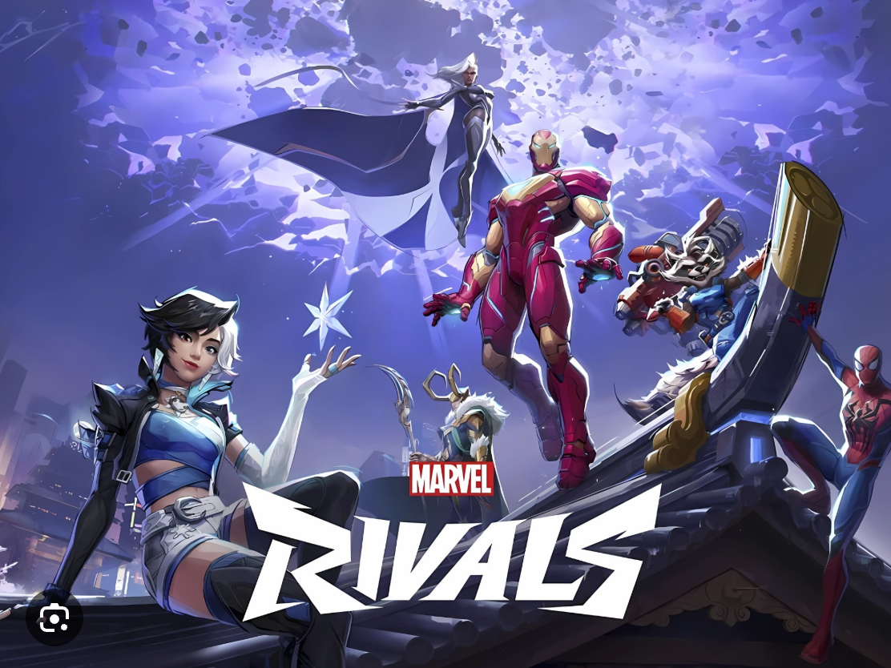

# Marvel Rivals Ranking Service API

This is a mock API to simulate the REST interface of an
imaginary service.

The Marvel Rivals Ranking service provides a cloud-hosted database through which you can search for your favorite Marvel Rival video game characters ranking. You can retrieve details like a character's name, healing type, damage type and level of difficulty.

## Tutorials

Learn how to do common tasks with in the Marvel Rivals Database Service.

First, do this tutorial to set up your development system for these tutorials. You only have to do this one time per development system.

* [Before you start a tutorial](tutorials/Getting_started.md)

After your system is ready, these tutorials show you how to perform common tasks.

## API reference docs

Detailed descriptions of the service's resources.

The API reference docs refer to a `{base_url}` when they
refer to the URL of a resource. The `{base_url}` value depends
on the installation of the service.

When run locally for testing, the `{base_url}` is
generally `http://localhost:3000`.

## Table of contents

- [Get all Marvel Rivals video game characters ranking by title](../api/get-duelists.md)!

[alt text](media/Cover.png)