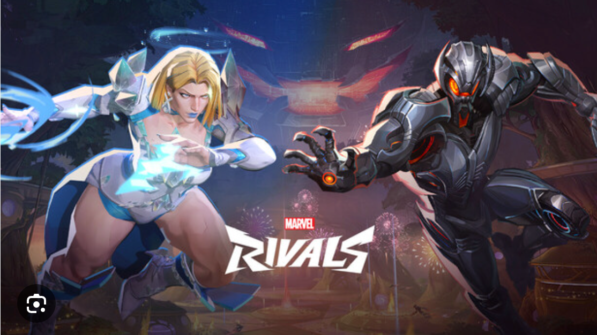

# Add a new superhero



This tutorial covers how to add a Marvel Rivals superhero to the Marvel Rivals Rankings database. You'll learn how to create the JSON data, use cURL commands to make POST requests, and verify the addition. 

## Prerequisites
- You have a REST API endpoint that allows you to add new superheros.
- The endpoint URL is `POST http://localhost:3000/duelists`.
- The JSON server or API server is running and accessible.

## Step 1. Prepare the JSON data
1. Create a JSON object representing the superhero you want to add. For example, let's add a new superhero Scarlet Witch to the database:

```
],
  "duelists": [
    {
      "superhero_name": "Scarlet Witch",
      "damage_type": "Projectile, Area of Effect",
      "difficulty": "3",
      "id": 1
    },
```
2. Save this JSON data in a file called `new_superhero.json`.

## Step 2. cURL command to add the new book
1. Use the POST method to send the JSON data to the server. To add the new comic book data under the scarletWitch category, use the following cURL command:

```
curl -X POST "https://api.example.com/duelists/scarletWitch" \
     -H "Content-Type: application/json" \
     -d @new_superhero.json
```

### Step 3: Using with the json-server
Follow these steps:

1. Start the json server
2. Verify the db.json file with the initial data. An excerpt below:

```
],
  "strategists": [
    {
      "superhero_name": "Cloak and Dagger",
      "healing_type": "Hit Scan (with Auto Aim), Area of Effect",
      "damage_type": "Hit Scan (with Auto Aim), Projectile",
      "difficulty": "3",
      "id": 1
    },
```

3. Start json-server using the command: `json-server -w db.json`
4. Create `new_superhero.json` file with new comic data. An example below:

```   
],
  "duelists": [
    {
      "superhero_name": "Scarlet Witch",
      "damage_type": "Projectile, Area of Effect",
      "difficulty": "3",
      "id": 1
    },
```

5. Use cURL to add the new comic book.

```
curl -X POST "http://localhost:3000/duelists/scarletWitch" \
     -H "Content-Type: application/json" \
     -d @new_superhero.json
```

## Step 4: Verifying the addition
1. To verify that the superhero has been added, you can use a GET request:

```
curl -X GET "http://localhost:3000/duelists/scarletWitch" -H "accept: application/json"
```
2. This should return the details of the newly added Scarlet Witch superhero.

You have successfully added a new superhero to your collection using cURL. 
