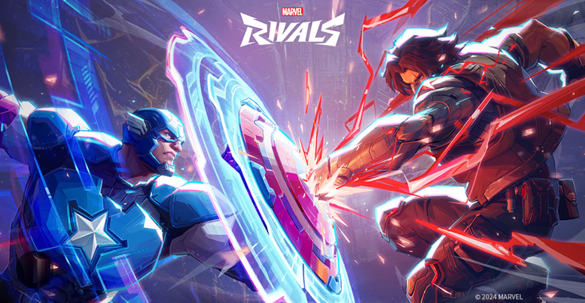

# Quickstart



<br>This tutorial shows you how to quickly get started. In this tutorial you will learn how to download the API files and try one of the available services. If you already [set up your development environment](/docs/tutorials/dev-env.md), the process should take about 15 minutes.

## Step 1: Confirm if you have the API files
The files are located in the [Marvel-Rivals repo](https://github.com/Davejurgens/marvel-rivals-repo) on 
GitHub. The 
directory contains the following files:

- `db.json`: a JSON file containing Marvel Rival profiles.
- `start-server.sh`: a shell script that starts JSON Server. Use this for Linux or macOS.
- `start-server.bat`: a batch file that starts JSON Server. Use this for Windows.

## Step 2: Start JSON Server with the `db` service
1. Open a terminal window and `cd` to the location of the json-server app.
2. Make sure the API files are in the same directory.
3. Start the service by typing `json-server -w db.json`. You should see some text to show the service is running:

    ```
     macBook:api <username>$ json-server -w db.json

     \{^_^}/ hi!

     db.json
     Done

     Resources
     http://localhost:3000/duelists
     http://localhost:3000/strategists
     http://localhost:3000/vanguards

     Home
     http://localhost:3000

     Type s + enter at any time to create a snapshot of the database
     Watching...
    ```

## Step 3: List the superheroes
You can use cURL the Marvel Rivals superheros.

### If you’re using cURL
1. Open a terminal window.
2. Run this command:
```
curl http://localhost:3000/duelists
```

## Step 4: Check the response
The response pane should show all the Duelist superheroes. An example below. 
 ```
   ],
  "duelists": [
    {
      "superhero_name": "Scarlet Witch",
      "damage_type": "Projectile, Area of Effect",
      "difficulty": "3",
      "id": 1
    },

